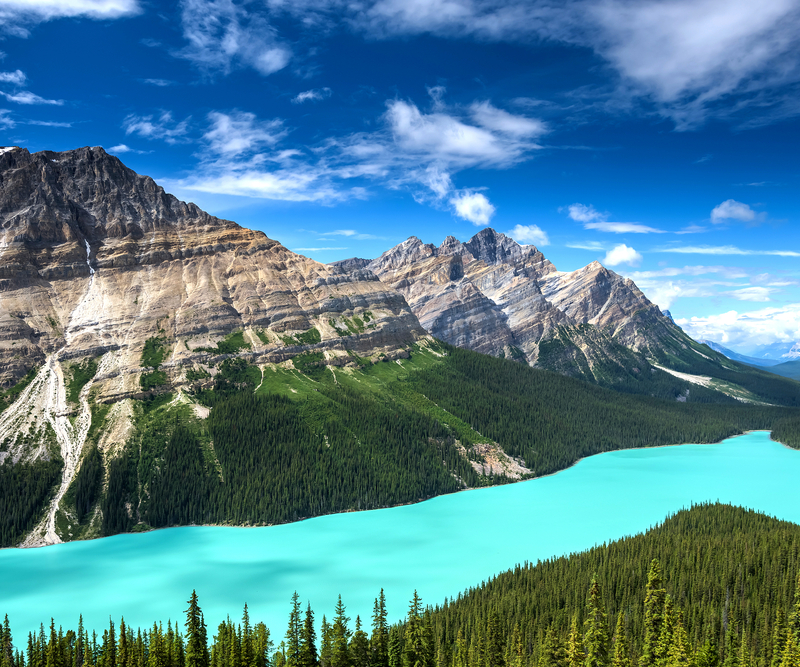

# when-are-the-lakes-at-their-bluest

A small project to understand what month you should go to Banff and Jasper National Parks if you want to see the lakes there at their bluest.

Context: I was planning a trip there, and first, I needed to understand when. Different articles advise going there in June, July, or August. But what month has the craziest blue lakes?

[source](https://www.travelawaits.com/2561483/peyto-lake-how-to-visit/)

To understand this, we will do the following:
- Use the Sentinel Hub Python package to create a mosaic image (to have the least cloud coverage possible) of selected lakes for each month in the last 7 years. Our go-to satellite for this is Sentinel 2.
- Develop a metric of how blue the lake is or, more precisely, its pixels (spectrophotometry and colorimetry).
- Take pixels of that lake (the whole polygon or just the ones in the centre, depends on clouds, needs some EDA) and apply this metric to them.
- Conclude which month corresponds to the bluest lakes over the years.
- Create some visualizations like [the one I created for Patagonia recently](https://drive.google.com/file/d/1Ba2JebXhiyNJQnqtTvsa1tW1fpArJbT7/view?usp=sharing)

This project is in progress — I will soon upload Jupyter Notebooks and supplementary files for it.
